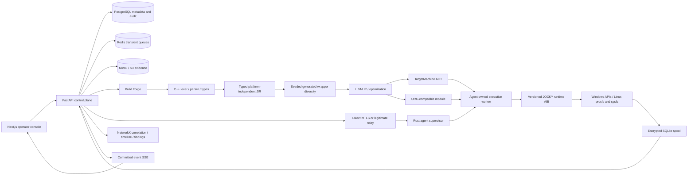

# Architecture

## Current versus target

The current repository includes the C++ frontend/JIR/LLVM compiler, Rust endpoint
runtime and PostgreSQL control plane. Phase 4 records a verified Linux bounded
inventory execution path, persisted observations, signed manifests and backend
SSE. See BUILD_STATUS.md for exact tests and platform limitations. The diagram
includes target components: local content-addressed storage is currently
authoritative; MinIO, relay and production controls are not implied operational.

For the idea-submission video, `infra/docker/prototype.compose.yaml` provides an
isolated DEMO database/API/dashboard. It uses the same compiler, models,
correlation, signing, storage and event contracts. Endpoint observations originate
in the backend fixture file with `simulation=true`; no endpoint execution is
claimed. The UI reads ordinary authenticated APIs and never synthesizes hashes,
findings or progress. See PROTOTYPE_STATUS.md and DEMO_FLOW.md.

## Decisions

1. **One monorepo, native-first compiler.** CMake manages C++20/LLVM, Cargo manages Rust, uv manages Python workspaces, npm workspaces manage TypeScript. Root Make targets compose them. Keep the compiler out of Python and React.
2. **Mandatory LLVM.** CMake uses `find_package(LLVM REQUIRED CONFIG)`. Ubuntu LLVM 18 is the reference baseline; newer majors must pass validation before being called supported. ORC probe proves linkage/code generation only. Complete source lowering and TargetMachine artifacts are subsequent acceptance gates. [LLVM CMake documentation](https://llvm.org/docs/CMake.html) describes `LLVM_DIR` discovery.
3. **Typed effectful JIR.** Stable op registry, explicit dataset types, source spans, capabilities and estimated costs. Backend lowering must preserve evaluation order for effectful collection. See JIR_SPEC.md.
4. **Rust host with a C ABI.** C++ does not own endpoint identity or OS policy. The Rust supervisor creates opaque runtime contexts containing granted capability scope, cancellation token, resource ledger, collector table and observation sink. C++ wrappers only call the registered ABI. No user-selected symbols or arbitrary libraries.
5. **Own-worker JIT.** The supervisor stays responsive; an Agent-owned execution worker contains ORC and collectors. This is the Agent's own execution process, never third-party injection. Worker termination bounds non-cooperative code and peak memory. Optional Windows JIT entitlement/policy conflicts are explicit compatibility outcomes.
6. **PostgreSQL is authoritative.** Redis carries ephemeral scheduling hints, not durable evidence or audit truth. Use a transactional outbox and append-only event offsets for job transitions. Celery is deferred until real asynchronous scheduling requires it; no redundant worker system in P0.
7. **Evidence bytes and metadata separate.** MinIO stores content-addressed blobs; PostgreSQL stores authorization/provenance and expected hashes. Atomic publish protocol stages objects, verifies hash, commits metadata and outbox, then acknowledges the agent. Orphans are reconciled. UI never accesses objects by unscoped storage key.
8. **Versioned contract authority.** Pydantic emits JSON Schema and TypeScript. Protobuf defines transport framing around canonical signed JSON, avoiding signatures over unstable protobuf serialization. Python refinement validation is stricter than generated structural TS types; every receiving boundary must validate independently.
9. **Monotonic events, no fabricated live state.** SSE uses committed sequence offsets, resumable cursors and heartbeats. Endpoint heartbeat age affects reported health; disconnection cannot be shown as online. A parent hunt summarizes independent child jobs rather than forcing a single success value.
10. **Measured frontend features.** Next.js with strict TypeScript/Tailwind/TanStack Query in P0; Monaco, React Flow, Recharts and optional shadcn primitives enter with working backend features. UI shell keeps empty/error/loading states. Next build and lint are separate checks, as documented for [Next.js installation](https://nextjs.org/docs/app/getting-started/installation).

## State and data model

Organization owns users, cases, endpoint identities and scripts. Script has immutable ScriptVersions. Compilation links ScriptVersion and zero or more Variants. Variant stores a VariantManifest; ExecutionPlan binds approved source/JIR/capabilities/budget to endpoints. Each endpoint receives its own Job attempt and nonce. Observations, Artifacts and Findings belong to a case/job with immutable provenance. TimelineEvent references an observation. AuditEvent is append-only. Report references a generated artifact. BenchmarkRun and CompatibilityRun retain environment and variant identity.

The shared schemas and existing SQLAlchemy model layer are implemented. Alembic revisions after the historical empty baseline create the domain tables, tenant relationships and PostgreSQL append-only protections. Fresh migrations are exercised by the integration suite and the separate video stack.

## Deployment and failure boundaries

Local development uses loopback API/dashboard and Docker backing services. TRUSTED_RELAY is a declared TLS gateway whose public host matches its certificate. The proxy template is not an active mTLS implementation. Agent mTLS must terminate at an authenticated boundary with protected peer identity, or pass through to the control plane; never trust public forwarded identity headers.

Compilation runs in restricted workers with source size/time/memory bounds. Unknown source operations fail diagnostics. An unconfigured API compiler returns 501. Non-ready orchestration returns readiness 503 even when liveness is 200. Missing LLVM fails the native build. Unsupported collectors return UNAVAILABLE/DENIED/PARTIAL, not static JSON. Object-store outages cause spool/retry with bounded quotas. Cancellation retains valid partial evidence and records final outcome. Retries receive a new job ID, nonce and expiry, linked to the previous attempt.

Build reproducibility pins source bytes, JIR schema, target triple, compiler/LLVM versions, optimization and seed. Wall-clock manifest creation belongs outside artifact identity. Encrypted-pool reproducibility uses a previously generated immutable pool blob as an additional build input; fresh key/nonce material intentionally changes that build input. See SECURITY_MODEL.md for nonce uniqueness.

## Environments and trust

Ubuntu 24.04 and supported Windows versions are endpoint targets; the precise Windows release matrix must be measured in P6/P10. macOS arm64 is only a development host today. Linux arm64 container tests do not prove Windows or x86_64 support. Production enablement requires mTLS, RBAC, signature verification, nonce durability, encrypted spool, tenant isolation, governor tests and independent Windows acceptance.

## Historical standalone boundary and current scope

Local standalone mode deliberately has no fake network peer. `jocky-agent init` creates an endpoint Ed25519 identity, a separate local-development signing authority, a bounded policy file and an AES-256-GCM spool key. Signed jobs are canonicalized with RFC 8785 rules, domain-separated, audience/expiry/capability/budget checked, and transactionally recorded in the nonce ledger before a child worker starts. Duplicate delivery returns its durable receipt without running again.

The supervisor owns concurrency locking, monotonic timeout/cancellation, bounded stdout/stderr, result-size enforcement and child termination. The child receives only a versioned fixed-registry collector request; it cannot select a command, library or ABI symbol. File count/bytes and approved roots are enforced in collector wrappers. Linux child CPU time and peak RSS are sampled but not hard-limited; Windows CPU/memory controls and network-byte accounting are unsupported. Strict jobs requiring those hard controls fail admission. See `docs/AGENT_RUNTIME.md` for the CLI and exact limitations.

The standalone boundary above predates the Phase 4 remote bridge. The current bridge authenticates compiler artifacts and invokes bounded inventory collectors in the agent-owned worker; exact supported operations and platform acceptance are in BUILD_STATUS.md. The separate compiler CLI fixture remains SIMULATED and cannot substitute for REAL endpoint evidence.
