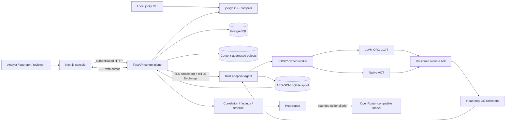
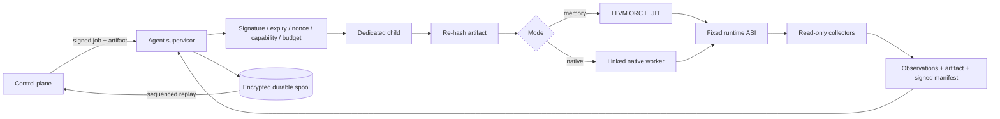
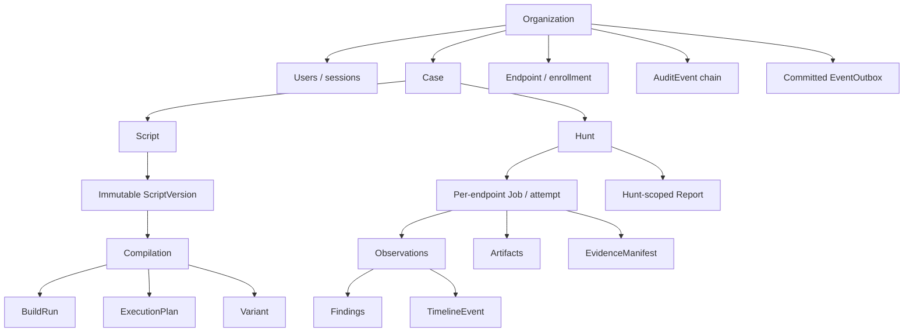
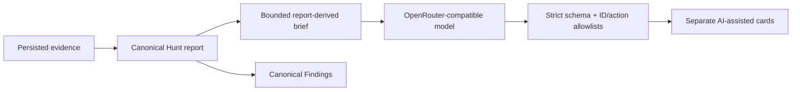
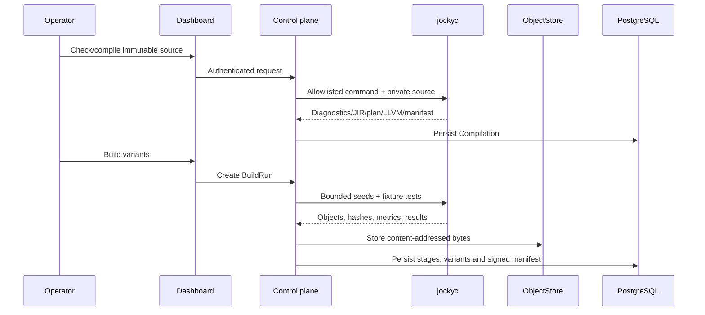
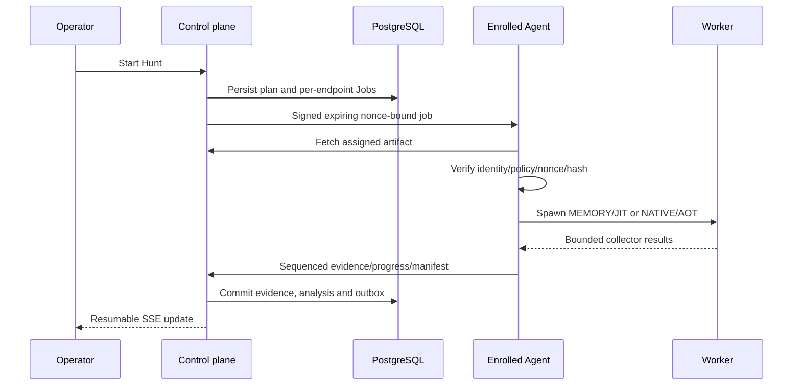

# JOCKY architecture

This document describes the repository architecture at commit `e268b39`
(2026-09-29). For exact verification and platform boundaries, see
[BUILD_STATUS.md](BUILD_STATUS.md). For the product surface, see
[FEATURES.md](FEATURES.md).

## Architectural intent

JOCKY turns authorized forensic intent into traceable compiler artifacts,
executes them inside supervised endpoint workers, and preserves identity and
integrity through evidence analysis and reporting.

Five boundaries define the system:

1. a handwritten C++20 forensic-language frontend;
2. typed, platform-independent JIR;
3. mandatory LLVM lowering and deterministic build diversity;
4. a Rust Agent that owns endpoint identity, policy and execution;
5. a tenant-scoped control plane and console that own durable workflow/evidence.

Python orchestrates the CLI and control plane. It does not parse, type-check or
interpret JOCKY.

## System context



The local compiler fixture and remote endpoint paths are deliberately separate.
`jocky run` uses a labeled deterministic fixture. REAL evidence comes through an
enrolled Agent and authenticated control-plane ingestion.

## Repository map

| Path                                         | Responsibility                                                                                           |
| -------------------------------------------- | -------------------------------------------------------------------------------------------------------- |
| `native/compiler`                            | Lexer, parser, AST, semantics, JIR, plans, LLVM lowering, diversity, AOT/ORC and metrics                 |
| `native/runtime`                             | Versioned C ABI, dataset ownership, closed dispatch, protected literals and optional local Python bridge |
| `services/agent`                             | Endpoint identity/policy, collectors, signed-job admission, supervision, mTLS, replay and spool          |
| `services/control-plane`                     | Domain API, PostgreSQL state, Build Forge, scheduler, gRPC, evidence, analysis and reports               |
| `apps/dashboard`                             | Authenticated Next.js console and SSE-driven resource refresh                                            |
| `cli`, `scripts/jockey`                      | Compiler discovery, command composition and isolated Python packages                                     |
| `packages/contracts`                         | Pydantic authority and generated JSON Schema/TypeScript                                                  |
| `proto`                                      | Versioned AgentControl transport around canonical JSON                                                   |
| `packages/jocky-language`                    | Editor metadata only; never an alternate compiler                                                        |
| `infra`                                      | Images, Compose topologies, monitoring templates and relay configuration                                 |
| `examples`, `fixtures`, `tests`, `benchmark` | Programs, labeled data, acceptance tests and measurement methodology                                     |

## Layered architecture

### 1. Language frontend

The compiler reads exact UTF-8 source and enforces source, token, nesting and type
complexity limits. Focused C++ modules own source locations, lexing, parsing, AST,
types, collector schemas, expressions, investigations and JIR.

Semantic analysis resolves immutable bindings, typed fields/expressions,
capabilities, budgets, nullable behavior, OS constraints and ordering. Diagnostics
have stable codes and source spans. Browser language metadata is only an editor
aid; authoritative parsing always happens in `jockyc`.

### 2. JIR and execution plans

`JIRModule` schema 1.0.0 is typed, effect-aware and platform-independent.
Instructions have stable IDs/opcodes, prior SSA operands, result schemas, source
spans, capability requirements, resource classes and effect predecessors.
Physical ABI layout and OS command names do not appear in semantic JIR.

`FrontendExecutionPlan` records unresolved selectors, collectors, capabilities,
budgets, expected schemas, projection/pushdown candidates, target/mode settings
and warnings. It remains non-dispatchable until endpoint policy and backend
compatibility are resolved.

Canonical JIR JSON has a deterministic hash and is carried unchanged inside the
protobuf `CanonicalDocument`, keeping signatures independent of protobuf runtime
serialization.

### 3. LLVM backend and diversity

The backend emits LLVM functions that call only fixed runtime ABI symbols. It
verifies IR, applies recorded optimization passes, emits TargetMachine objects and
can add the same module to ORC LLJIT.

Diversity happens after semantic JIR. A seed selects bounded helper ordering,
names and wrapper structure. It can change optimized IR, structural fingerprints
and object bytes, but cannot change semantic operations, capabilities, budgets,
evidence membership or effect order.

Compiler outputs include source/JIR/LLVM/artifact identities, target/toolchain
metadata, stage measurements, structural metrics, object bytes/manifests and
labeled fixture equivalence results. LLVM is required at configuration; there is
no fake backend or interpreter fallback.

### 4. Runtime ABI and Python bridge

The versioned C ABI uses opaque contexts, fixed-width dataset handles, explicit
retain/release ownership, status/error views and a closed opcode surface. STL
objects, exceptions, arbitrary symbols, OS handles and untrusted native payloads
do not cross it.

The host context owns capability grants, cancellation/deadline state, resource
accounting, collector callbacks and observation sinks. Protected literals are
authenticated and decrypted per instruction; owned key/plaintext buffers are
cleansed.

The optional local Python bridge is reached through the closed `PYTHON_CALL`
analysis opcode. It imports from the isolated package directory, accepts bounded
literal scalar arguments and returns a scalar through the existing dataset-handle
lifecycle. It is not a general FFI and is not used by the remote Agent worker.

### 5. Endpoint Agent and worker

The Rust supervisor retains identity, policy, nonce ledger, encrypted spool and
the network session. Compiler execution and collection happen in a child process.



Admission consumes the nonce durably before execution. An exact duplicate returns
the receipt. The supervisor enforces one worker, timeout/cancellation and bounded
output/I/O. Linux CPU/RSS are observed, but hard CPU/RAM/network controls remain
incomplete; strict requests for unavailable controls are rejected.

### 6. Agent transport

`proto/jocky/v1/agent.proto` exposes:

- `Enroll`: TLS, one-time token, CSR and evidence-key possession proof;
- `Exchange`: mTLS bidirectional heartbeats, sequenced evidence, jobs,
  cancellation and acknowledgements;
- `FetchJobArtifact`: mTLS stream restricted to the endpoint's assigned job.

Frames carry exact canonical JSON, explicit simulation presence and monotonic
sequence. Exact replay is idempotent; different bytes at a consumed sequence are
rejected.

DIRECT connects to AgentControl. TRUSTED_RELAY passes TLS bytes to one fixed
backend without terminating or inspecting them, so endpoint mTLS identity remains
end-to-end. Transport mode is stored as authenticated provenance.

### 7. Control plane

FastAPI supplies authenticated, organization-scoped APIs plus public
liveness/status utilities. Its services cover:

- authentication/RBAC, users, cases and immutable scripts;
- bounded native compiler invocation and persisted stage output;
- Build Forge, cross-target publication and variant comparison;
- endpoint enrollment, heartbeat health, revocation and local-Agent lifecycle;
- Hunt planning, per-endpoint jobs, retry, cancellation and deadline sweeping;
- evidence ingestion, content verification and manifest verification;
- correlation, findings, graph, timeline, benchmarks and compatibility records;
- Hunt reports, audit/outbox events and optional hypotheses.

The compiler service uses private temporary input, an allowlisted command, no
shell and a timeout. The HTTP and gRPC services share PostgreSQL, signing and
object services.

### 8. Persistence and ownership

PostgreSQL is authoritative for identity, tenancy, workflow and metadata.



Evidence bytes are separate from metadata in a content-addressed local
ObjectStore. PostgreSQL retains expected hash, size, media type, tenant/case/job
membership and storage key. Verification reads bytes and recomputes SHA-256.
MinIO is provisioned in some infrastructure profiles but is not authoritative in
the active prototype.

### 9. Evidence and audit model

Every real observation carries organization, case, endpoint, job, collector,
platform, times, variant and `simulation=false`. Its hash covers schema-normalized
RFC 8785 JSON excluding only the hash field itself.

The endpoint signs a manifest binding ordered observation hashes to source, JIR,
LLVM, artifact, endpoint, job, transport and execution metadata. Signature,
integrity and provenance are verified separately.

Audit events form a per-organization linear chain:

```text
H[n] = SHA-256(canonical(event[n] with sequence n and previous_hash H[n-1]))
```

Genesis uses 64 zeroes. Verification rejects edits, gaps, reordering and mixed
organizations. This is **not a Merkle tree**: there is no Merkle root or inclusion
proof. An external signed head checkpoint is still needed to detect tail
truncation or wholesale recomputation by a storage-controlling attacker.

### 10. Analysis, reports and optional AI

Correlation reads committed observations to create typed relationships, findings
and normalized timeline events; the UI does not invent results. Partial Hunt
failure preserves successful sibling evidence.

Hunt reporting queries only the selected Hunt, creates deterministic canonical
JSON, stores it content-addressably, writes Artifact/Report rows and appends an
audit event. Retrieval re-verifies the bytes.

Optional hypothesis analysis is downstream and separate:



Exact source/full raw observations are excluded from the provider brief.
Analysis is bound to the report artifact hash and cannot mutate Findings or the
canonical report. Provider failure leaves report generation successful.

### 11. Operator console

The strict-TypeScript Next.js console uses an HttpOnly same-site session cookie
and allowlisted server proxy. TanStack Query owns resource state; authenticated
SSE events invalidate relevant queries using committed sequence IDs and
`Last-Event-ID` resumption.

The UI consumes authoritative APIs for compiler stages, Build Forge, endpoints,
investigations, evidence and analysis. Loading, empty, unavailable, partial,
error and retry states are explicit. REAL, DEMO/SIMULATED, SANDBOX and measured
fixture states remain distinct.

The semantic timeline groups persisted rows into an investigation narrative. It
is a presentation projection, not a new evidence source.

## Core flows

### Compilation and Build Forge



### Live endpoint investigation



### Offline replay

Pending Agent payloads are AES-256-GCM encrypted in SQLite with record-bound AAD.
Reconnect replays them in sequence. The server stores endpoint/sequence/frame-hash
receipts: exact redelivery is idempotent and conflicting redelivery is rejected.

## Trust boundaries

| Boundary              | Controls                                                                     | Residual gap                                               |
| --------------------- | ---------------------------------------------------------------------------- | ---------------------------------------------------------- |
| Browser → API         | HttpOnly session, RBAC, tenant scoping, bounded schemas                      | Prototype, not production IdP deployment                   |
| API → compiler        | Private temp input, allowlist, no shell, timeout                             | Background task is not a crash-resuming queue              |
| Control plane → Agent | One-time enrollment, CSR binding, mTLS, signed jobs, nonce/expiry, receipts  | Rotation and production credential storage                 |
| Agent → worker        | Assigned artifact, hash check, child isolation, timeout/cancel/output bounds | JIT is not a full sandbox; hard resource limits incomplete |
| Worker → OS           | Fixed ABI, capability/path policy, read-only registry                        | Kernel compromise can falsify user-space visibility        |
| Agent → spool         | AES-GCM, external key, durable acknowledgement                               | Quotas and Windows credential-store integration            |
| API → objects         | Tenant membership plus content re-hash                                       | Local volume authority and external-store hardening        |
| Audit                 | Append-only DB protections and hash chain                                    | No external checkpoint or Merkle proofs                    |
| DEMO → REAL           | Required simulation bit/label and mode checks                                | Shared-host demos still need honest presentation           |
| Report → AI           | Bounded brief, strict schema and allowlists                                  | Live-provider/privacy review is deployment-specific        |

## Failure semantics

- Invalid source produces a diagnostic, never approximate execution.
- Missing LLVM fails configuration/build.
- Unsupported JIR, target or mode fails lowering/admission.
- Replayed, expired, wrongly addressed or over-capability jobs fail before work.
- Artifact mismatch fails before JIT/native launch.
- Permission denial and unavailable collectors remain explicit.
- One endpoint failure does not erase sibling evidence.
- The sweeper reclaims deadlines and marks lapsed heartbeats OFFLINE.
- Integrity, signature and provenance are independent verdicts.
- Optional AI failure does not fail the report.
- Missing measurements remain null/unavailable, never zero.

## Deployment topology

The verified local prototype contains PostgreSQL 17.6, FastAPI, a
deadline/heartbeat sweeper, gRPC AgentControl, the TLS pass-through relay, three
independent Linux Agent launcher/state volumes, Next.js and a content-addressed
object volume.

Agent 2 traverses the relay; Agents 1 and 3 connect directly. They use the same
Rust Agent/protocol as an external Linux host, but share one Docker environment.

Linux x86_64/aarch64 is the working endpoint target. Windows x86_64 Agent code
and real COFF compiler output exist, but live linking/execution/collector
acceptance remains environment-dependent. macOS is a development host only.

## Contract and version authority

- Pydantic defines canonical application documents/refinements.
- Generated JSON Schema/TypeScript serves structural consumers.
- Protobuf v1 defines Agent transport framing.
- JIR/compiler versions define compiler compatibility.
- Runtime ABI version defines generated-code/host compatibility.
- Separate signature domains distinguish jobs, evidence and builds.

Changing required fields, enum meaning, canonicalization or signature content
requires an explicit version transition. Static TypeScript types never replace
runtime validation at a trust boundary.

## Current limits and next gates

1. Native live Windows compiler/Agent/collector acceptance.
2. Certificate rotation and production OS-backed credential storage.
3. Hard CPU/RAM/network governance and spool quotas.
4. Broader remote JIR execution beyond bounded inventory.
5. External object-store authority and signed audit checkpoints.
6. Fleet-scale fault/load and distributed performance trials.
7. Optional adapters and authenticated risk-intelligence ingestion.
8. Production observability, retention, backup and deployment hardening.

The architecture intentionally excludes driver exploitation, callback removal,
arbitrary process injection, hollowing, reflective injection, unhooking, syscall
evasion, privilege escalation, persistence installation, covert SOCKS routing and
domain fronting.
